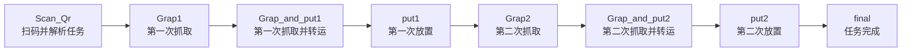

# 2025–2026 广东省工创赛 STM32F4 智能车学习代码

> 从 **STM32F407、DMA 串口、姿态闭环、K230 视觉** 到 **四麦轮车身漂移与机械臂协同** 的竞赛项目学习记录。**效果展示链接【26工创智能物流搬运法法法】https://www.bilibili.com/video/BV1aPby6JE3m?vd_source=b49db87181cf66708cab1a6a5ae689f2**

这是 2025–2026 广东省工程实践与创新技能比赛初赛项目的主控工程。它不是只让小车“跑起来”的示例：代码将扫码任务、视觉微调、四麦轮运动学、姿态锁定、串口步进电机和三自由度执行机构串成了一套完整的比赛流程。

仓库适合想了解 STM32 多串口 DMA、麦克纳姆轮底盘、视觉辅助定位、竞赛状态机和机械臂动作编排的同学参考。项目里的参数均为实际赛场调试结果，请把它当作学习起点，而不是无需调参即可复现的成品。

## 我做了什么

- 使用 **STM32F407VGT6** 作为主控，工程采用 STM32F4 标准外设库，HSE 8 MHz 经 PLL 配置为 168 MHz。
- 通过 **四路串口 42 型步进电机** 驱动四麦轮底盘；代码以电机地址 `0x05 / 0x08 / 0x06 / 0x09` 管理四个轮组，支持速度、位置、绝对位置、回零、到位查询和同步下发。
- 将世界坐标速度转换为车体坐标速度，再通过四麦轮逆运动学分配轮速；配合 HWT101 的航向角 PID 锁定，实现横移、斜移、转向，以及保持车头方向的“车身漂移”式运动表现。
- 通过 **K230 视觉模块** 回传目标的 `dx / dy` 偏差，在主控侧用二维视觉 PID 做最后一段对准；视觉到位后停车并继续抓取流程。
- 使用 **GM65 类串口扫码模块** 读取形如 `123+456` 的任务码，解析为六个任务位，并将结果显示到 LCD、转发给视觉端，驱动后续的分类与搬运流程。
- 以三路 PWM 舵机完成夹爪、转盘、皮带/升降执行机构的协同动作，并加入 S 曲线平滑过渡，减小机构动作时的突变。
- 使用 SysTick 1 ms 时基和轻量级时间片调度，在不使用 RTOS 的前提下运行赛题总状态机、底盘动作序列和执行机构流程。
- 设计了**分层顶层状态机**：用统一的阶段调度器管理整场任务，再将底盘路径、视觉微调与抓取/放置分别拆为可验证的子状态机，避免把所有赛题逻辑堆进一个大循环。

## 硬件组成

| 模块 | 工程中的作用 | 接口与关键参数 |
| --- | --- | --- |
| STM32F407VGT6 | 主控、流程调度、底盘与机构控制 | HSE 8 MHz，系统时钟 168 MHz |
| 四麦轮底盘 + 4 路 42 型步进电机 | 全向移动、横移、斜移、转向与漂移表现 | USART3，115200 bps；PB10/PB11；DMA 收发 |
| HWT101 姿态传感器 | 获取航向角，为直行/横移/视觉微调提供锁航向反馈 | UART4，230400 bps；PC10/PC11；DMA 接收 |
| K230 视觉模块 | 提供目标横纵偏差和视觉到位标志 | USART2，115200 bps；PA2/PA3；DMA 收发 |
| GM65 类扫码模块 | 读取任务码，解析任务排序 | USART6，9600 bps；PC6/PC7；DMA 接收 |
| 三路舵机 | 夹爪、转盘、皮带/升降等机构动作 | TIM2_CH1 / PA5，TIM2_CH2 / PB3，TIM9_CH2 / PE6 |
| SPI LCD | 显示扫码任务与运行状态 | PB12–PB15、PB1、PC5（软件 SPI） |

> 电机型号、驱动器供电、电源拓扑、机械尺寸和实际接线仍需以实物为准。上表来自当前主控源码，不应替代电气检查。

## 软件架构

```text
扫码模块 ──> 任务码解析 ──> LCD 显示 / K230 任务下发
                              │
K230 视觉偏差 ──> 二维视觉 PID ┼──> 四麦轮逆运动学 ──> 串口步进电机
                              │              ▲
HWT101 航向角 ──> 航向 PID ───┘              │
                                             底盘运动序列

赛题总状态机 ───────────────────────────────> 三路舵机与抓取/放置动作
```

## 顶层状态机：整场比赛的“总导演”

本项目最重要的框架之一是 `Hardware/control.c` 中的 `DingChen_State` 顶层状态机。它并不直接把每一步的电机命令写在 `main()` 中，而是将比赛流程拆成清晰的阶段，并只在当前阶段调度对应的底盘与机构任务：



每一个顶层阶段都采用同一套协作模式：

1. **底盘子状态机先行动。** `PID_State_Function()` 为当前阶段读取一段 `PID_Data_Type` 动作序列，调用 `Chassis_Core()` 完成加速、匀速、减速、归位或转向；结束后置位 `PID_Task_Completed_Flag`。
2. **专用动作子状态机随后接管。** 如 `Scan_Qr_State_Function()`、`Grap1_State_Function()`、`Grap_and_put1_State_Function()` 等，分别处理扫码、K230 视觉对准、舵机抓取、机构转运和放置。
3. **两个完成标志负责交接。** 顶层状态机等待“底盘已到位”和“本阶段专用动作已完成”两个事件：前者启动本阶段子流程，后者切换到下一顶层阶段并复位相关标志。

这种结构把“**去哪里**”（底盘动作）、“**看什么**”（视觉/扫码）和“**做什么**”（抓取、转运、放置）分开管理。调试时可以单独卡在某一阶段观察，不需要重新跑完整场流程；改赛题顺序、替换某段路径或增加一个新动作时，也只需改对应状态和序列，而不会破坏其他模块。

此外，顶层状态机由 10 ms 周期任务 `DingChen_State_Function()` 驱动，底盘 S 曲线、舵机平滑更新和串口 DMA 接收则在各自时基下独立运行。这让整车在任务切换时仍能持续接收姿态、视觉和扫码数据。

### 关键代码入口

| 文件 | 建议从这里学习 |
| --- | --- |
| `User/main.c` | 外设初始化顺序与主循环入口 |
| `Hardware/MC.c` | 串口步进电机协议、四麦轮逆运动学、S 曲线加减速、航向 PID |
| `Hardware/HWT101.c` | HWT101 帧解析、航向归一化、UART + DMA + IDLE 接收 |
| `Hardware/K230.c` | K230 通信协议、视觉偏差解析、视觉微调 PID |
| `Hardware/SaoM.c` | 扫码模块协议与 `123+456` 任务码解析 |
| `Hardware/control.c` | 扫码、抓取、搬运、放置等赛题流程状态机 |
| `Hardware/Servo.c` | 三路 PWM 舵机与 S 曲线平滑控制 |

## “车身漂移”是怎样实现的

这里的漂移不是单纯把四个电机同时加速，而是在指定航向不变的情况下叠加横向/纵向速度：

1. HWT101 输出实时航向角，主控计算目标航向与当前航向的最短角度误差。
2. 航向 PID 计算角速度补偿，同时将世界坐标系下的 `vx / vy` 旋转到车体坐标系。
3. 四麦轮逆运动学将 `vx`、`vy` 和角速度 `w` 分配成四个电机的独立速度。
4. 速度指令经 USART3 + DMA 发给四个步进电机，并通过同步指令让轮组同时执行。

因此小车可以在车头保持指定方向的同时横移、斜移或绕行，形成更有表现力的车身漂移效果。这套思路也被复用于 K230 视觉对准：视觉给出偏差，二维 PID 生成微调速度，航向 PID 负责“锁住车头”。

**补充一下世界坐标系，下面这个是世界坐标系(我调试的时候是用了这个坐标系，如果觉得跟平时学的二维坐标系不同，可以自行改正哦)**

**其次是角度问题，角度大小就是车头跟正方向的夹角，从左到右是越来越小的角度，也就是我图中正方向的左边是180~0，右边是0~-180，关注一下这两个问题，你的底盘也能顺利起飞**
## 项目学习路线

这份工程记录的不是一次性拼装，而是一条能从源码中追溯的学习路径：

1. **从 F1 到 F4：** 主程序保留了从 STM32F103RCT6 迁移到 STM32F407VGT6 的引脚和时钟迁移说明，涉及外设总线、复用功能、DMA Stream/Channel 和 168 MHz 时基的适配。
2. **先把通信做稳定：** 姿态、视觉、电机、扫码分别使用独立串口；高频或多字节数据使用 DMA + IDLE 中断收帧，避免轮询接收影响控制循环。
3. **再让底盘可控：** 从单个电机的速度/位置命令，到四轮同步下发、坐标变换和航向闭环，逐步形成可复用的底盘控制核心。
4. **把“看见”变成“对准”：** K230 只负责输出偏差，主控负责滤波式 PID 微调与停车判定，让视觉模块与运动控制解耦。
5. **最后串成赛题流程：** 以 `DingChen_State` 顶层状态机调度扫码、行驶、视觉微调、抓取、分类和放置；再用底盘和专用动作子状态机完成每个阶段，舵机采用平滑轨迹，减少机构动作对整车的冲击。

如果你刚接触这类项目，推荐按 `main.c → MC.c → HWT101.c → K230.c → control.c` 的顺序阅读，而不是一开始就钻进长状态机。

## 编译与调试

1. 安装 Keil MDK，并准备 `Keil.STM32F4xx_DFP`（工程记录为 3.1.0）及 STM32F4 标准外设库环境。
2. 用 Keil 打开 `project.uvprojx`，确认目标芯片为 `STM32F407VGTx`。
3. 首次上电前，先断开底盘和机械臂动力，单独检查 3.3 V 逻辑电平、串口 TX/RX 交叉、共地和传感器输出。
4. 依次验证姿态角、扫码、K230 通信、单电机命令、四轮同步、舵机限位，最后再联调完整流程。
5. 根据实际底盘尺寸、轮子安装方向、电机细分、机械臂零位和赛场光照重新调节 `CHASSIS_RADIUS`、`SPEED_RATIO`、PID 参数、动作时序与舵机角度。

## 仓库范围与说明

- 当前工程包含 STM32F4 主控程序、标准外设库和 Keil 工程文件。
- K230 在本工程中以串口视觉从机的方式接入；**K230 端模型、脚本和训练数据不在当前目录内**，需要单独准备。
- 参数与动作顺序服务于当时的赛场设备和机械结构；复用时请先在抬空或低速状态下验证，避免机构碰撞、失控运动或步进电机堵转。
- 这是竞赛学习代码，欢迎参考、讨论和改进。若计划公开复用，建议补充 `LICENSE`、实物接线图、K230 端代码和演示视频。
